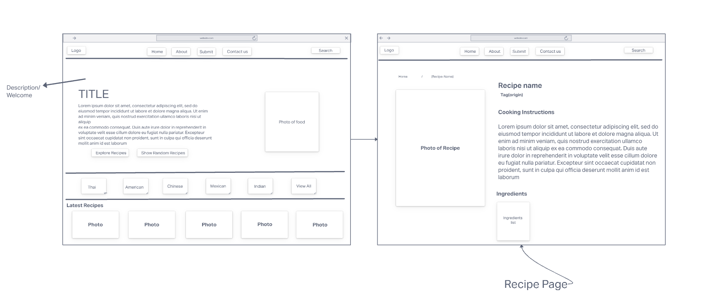

# Project 2 : Recipe Blog
I decided to make a Recipe Blog that allows you to search through different categories of recipes and even submit some recipes yourself. 

# User Stories
As a user:
- I would like to discover different recipes
- I would like to search for recipes
- I would like to submit recipes
- I want to see detailed pictures and information 
- I want to see latest recipes
- I would like to find randome recipes

# Technologies Used
- Node.sj
- MongoDB
- Express
- EJS
- Mongoose
- Bootstrap
- NPM Dependencies
- JavaScript
- Heroku

# Wireframe Sketch
